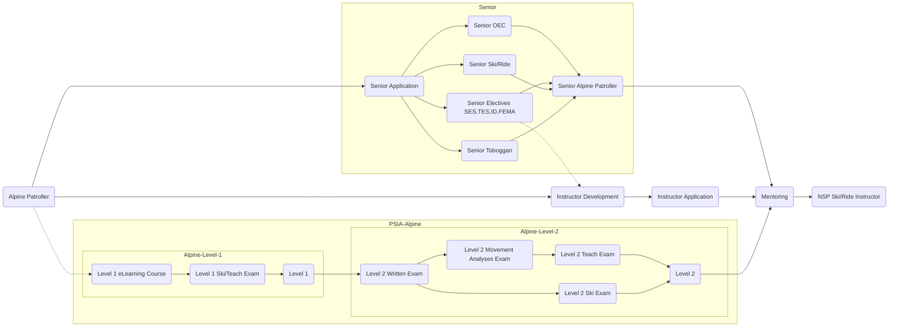

```mermaid
  flowchart LR;
      AP(Alpine Patroller) --> SPA(Senior Application);
      subgraph Senior
      SPA --> SOEC(Senior OEC);
      SPA --> SE(Senior Electives SES,TES,ID,FEMA);
      SPA --> SR(Senior Ski/Ride);
      SPA --> ST(Senior Toboggan);
      SOEC --> SP(Senior Alpine Patroller);
      SE --> SP;
      SR --> SP;
      ST --> SP;
      end
      SE -.-> ID;
      SP --> M;
      AP --> ID(Instructor Development);
      ID --> IA(Instructor Application);
      IA --> M(Mentoring);
      M --> SRI(NSP Ski/Ride Instructor);
      
      subgraph PSIA-Alpine
      subgraph Alpine-Level-1
      L1W(Level 1 eLearning Course) --> L1E(Level 1 Ski/Teach Exam);
      L1E --> L1C(Level 1);
      end
      L1C --> L2W;
      subgraph Alpine-Level-2
      L2W(Level 2 Written Exam) --> L2MA(Level 2 Movement Analyses Exam);
      L2MA --> L2T(Level 2 Teach Exam);
      L2W --> L2S(Level 2 Ski Exam);
      L2T --> L2C(Level 2);
      L2S --> L2C;
      end
      end
      L2C --> M;
      AP -.-> L1W;
```
