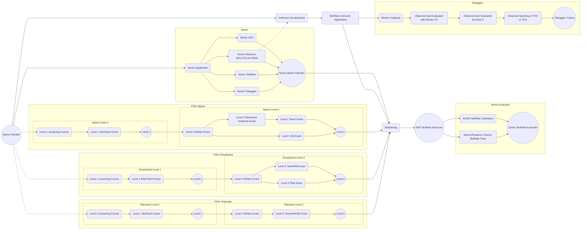

```mermaid
  flowchart LR;
      AP((Alpine Patroller)) --> SPA;
      subgraph Senior
      SPA(Senior Application) --> SOEC(Senior OEC);
      SPA --> SE(Senior Electives SES,TES,ID,FEMA);
      SPA --> SR(Senior Ski/Ride);
      SPA --> ST(Senior Toboggan);
      SOEC --> SP((Senior Alpine Patroller));
      SE --> SP;
      SR --> SP;
      ST --> SP;
      end
      SE -.-> ID;
      SP --> M;
      AP --> ID(Instructor Development);
      ID --> IA(Ski/Ride Instructor Application);
      IA --> M(Shadowing);
      M --> SRI((NSP Ski/Ride Instructor));
      
      subgraph PSIA-Alpine
      subgraph Alpine-Level-1
      L1W(Level 1 eLearning Course) --> L1E(Level 1 Ski/Teach Exam);
      L1E --> L1C((Level 1));
      end
      L1C --> L2W;
      subgraph Alpine-Level-2
      L2W(Level 2 Written Exam) --> L2MA(Level 2 Movement Analyses Exam);
      L2MA --> L2T(Level 2 Teach Exam);
      L2W --> L2S(Level 2 Ski Exam);
      L2T --> L2C((Level 2));
      L2S --> L2C;
      end
      end
      
      subgraph PSIA-Snowboard
      subgraph Snowboard-Level-1
      BL1W(Level 1 eLearning Course) --> BL1E(Level 1 Ride/Teach Exam);
      BL1E --> BL1C((Level 1));
      end
      BL1C --> BL2W;
      subgraph Snowboard-Level-2
      BL2W(Level 2 Written Exam) --> BL2T(Level 2 Teach/MA Exam);
      BL2W --> BL2S(Level 2 Ride Exam);
      BL2T --> BL2C((Level 2));
      BL2S --> BL2C;
      end
      end

      subgraph PSIA-Telemark
      subgraph Telemark-Level-1
      TL1W(Level 1 eLearning Course) --> TL1E(Level 1 Ski/Teach Exam);
      TL1E --> TL1C((Level 1));
      end
      TL1C --> TL2W;
      subgraph Telemark-Level-2
      TL2W(Level 2 Written Exam) --> TL2T(Level 2 Teach/MA/Ski Exam);
      TL2T --> TL2C((Level 2));
      end
      end
      
      
      L2C --> M;
      BL2C --> M;
      TL2C --> M;
      AP -.-> L1W;
      AP -.-> BL1W;
      AP -.-> TL1W;

      SRI --> ADSW(ADSW Ski/Ride Calibration);
      SRI --> SH(Mentor/Shadow 2 Senior Ski/Ride Tests);
      subgraph Senior-Evaluator
      ADSW --> SS((Senior Ski/Ride Evaluator));
      SH --> SS;
      end
      
      IA --> MA(Mentor Assigned);
      subgraph Toboggan
      MA --> OE(Observed and Evaluated with Mentor 2X);
      OE --> IT(Observed and Evaluated by Area IT);
      IT --> TTW(Observed teaching a TTW or TES );
      TTW --> C((Toboggan Trainer));
      end
```
