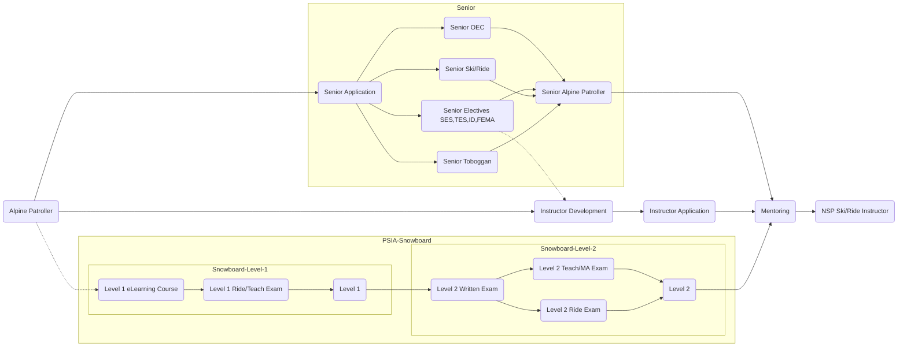

```mermaid
  flowchart LR;
      AP(Alpine Patroller) --> SPA(Senior Application);
      subgraph Senior
      SPA --> SOEC(Senior OEC);
      SPA --> SE(Senior Electives SES,TES,ID,FEMA);
      SPA --> SR(Senior Ski/Ride);
      SPA --> ST(Senior Toboggan);
      SOEC --> SP(Senior Alpine Patroller);
      SE --> SP;
      SR --> SP;
      ST --> SP;
      end
      SE -.-> ID;
      SP --> M;
      AP --> ID(Instructor Development);
      ID --> IA(Instructor Application);
      IA --> M(Mentoring);
      M --> SRI(NSP Ski/Ride Instructor);
      
      
      subgraph PSIA-Snowboard
      subgraph Snowboard-Level-1
      BL1W(Level 1 eLearning Course) --> BL1E(Level 1 Ride/Teach Exam);
      BL1E --> BL1C(Level 1);
      end
      BL1C --> BL2W;
      subgraph Snowboard-Level-2
      BL2W(Level 2 Written Exam) --> BL2T(Level 2 Teach/MA Exam);
      BL2W --> BL2S(Level 2 Ride Exam);
      BL2T --> BL2C(Level 2);
      BL2S --> BL2C;
      end
      end
      
      BL2C --> M;
      AP -.-> BL1W;
```
