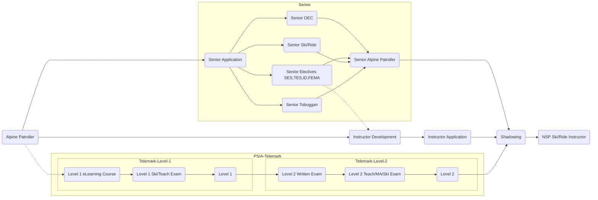

```mermaid
  flowchart LR;
      AP(Alpine Patroller) --> SPA(Senior Application);
      subgraph Senior
      SPA --> SOEC(Senior OEC);
      SPA --> SE(Senior Electives SES,TES,ID,FEMA);
      SPA --> SR(Senior Ski/Ride);
      SPA --> ST(Senior Toboggan);
      SOEC --> SP(Senior Alpine Patroller);
      SE --> SP;
      SR --> SP;
      ST --> SP;
      end
      SE -.-> ID;
      SP --> M;
      AP --> ID(Instructor Development);
      ID --> IA(Instructor Application);
      IA --> M(Shadowing);
      M --> SRI(NSP Ski/Ride Instructor);
      
      subgraph PSIA-Telemark
      subgraph Telemark-Level-1
      TL1W(Level 1 eLearning Course) --> TL1E(Level 1 Ski/Teach Exam);
      TL1E --> TL1C(Level 1);
      end
      TL1C --> TL2W;
      subgraph Telemark-Level-2
      TL2W(Level 2 Written Exam) --> TL2T(Level 2 Teach/MA/Ski Exam);
      TL2T --> TL2C(Level 2);
      end
      end
      
      
      TL2C --> M;
      AP -.-> TL1W;
```
