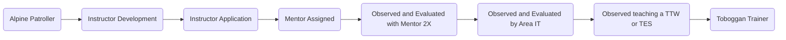

```mermaid
  flowchart LR;
      AP(Alpine Patroller) --> ID(Instructor Development);
      ID --> IA(Instructor Application);
      IA --> MA(Mentor Assigned);
      MA --> OE(Observed and Evaluated with Mentor 2X);
      OE --> IT(Observed and Evaluated by Area IT);
      IT --> TTW(Observed teaching a TTW or TES );
      TTW --> C(Toboggan Trainer);
```
